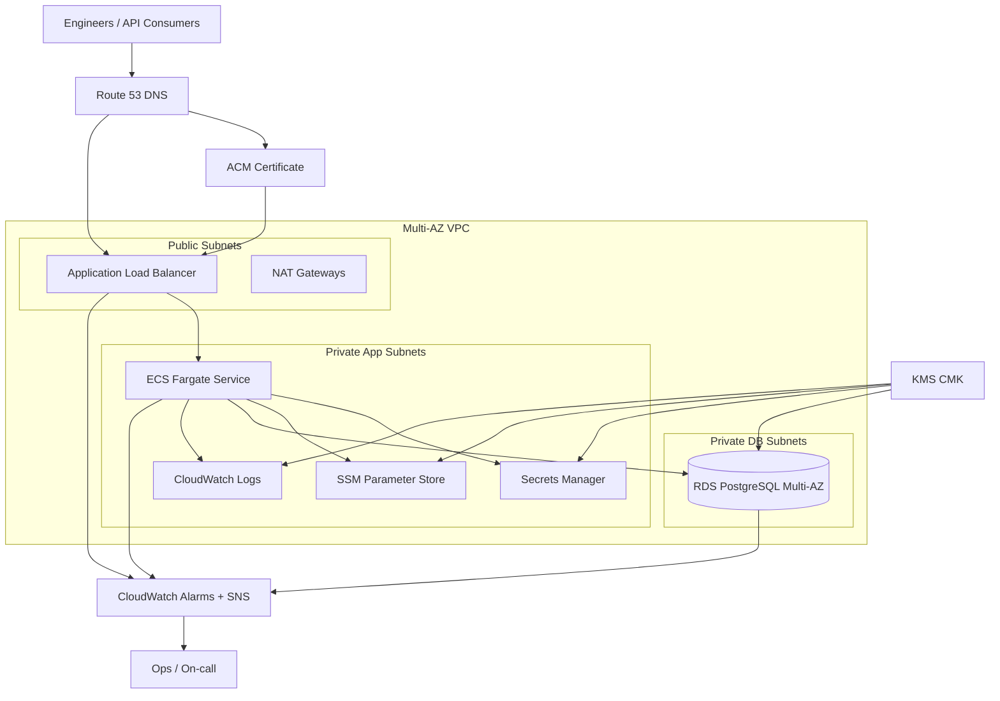

# Architecture

This platform models a production-style API collaboration and testing application similar to Postman, deployed on AWS with private compute and database tiers, TLS termination at the edge, and reusable infrastructure modules.

## Design goals

- Keep internet-facing exposure limited to the ALB.
- Run stateless application containers on ECS Fargate across multiple AZs.
- Keep PostgreSQL private, encrypted, and highly available.
- Use managed services where they reduce operational load without sacrificing control.
- Make lower environments cheaper while keeping production patterns consistent.

## Architecture diagram

## Request flow

1. Client traffic resolves through Route 53 to the ALB alias record.
2. ACM provides the certificate for the HTTPS listener.
3. The ALB terminates TLS and forwards requests to the ECS Fargate target group.
4. ECS tasks run only in private subnets and retrieve secrets from Secrets Manager and SSM at runtime.
5. The application connects to the Multi-AZ PostgreSQL instance in private DB subnets.
6. Logs and metrics flow into CloudWatch, with alarms routed to SNS.

## Why ECS Fargate

- No node lifecycle management or AMI patching burden.
- Easier least-privilege boundaries through task execution and task roles.
- Straightforward horizontal scaling using target tracking autoscaling.
- Strong fit for stateless HTTP APIs and internal platform applications.

## Environment posture

- `dev`: same core architecture, but uses a single NAT gateway and relaxed data retention to control cost.
- `stage`: mirrors production networking and availability with moderate instance sizing.
- `prod`: full high-availability posture, multi-AZ spread, stricter retention, deletion protection, and larger autoscaling limits.
